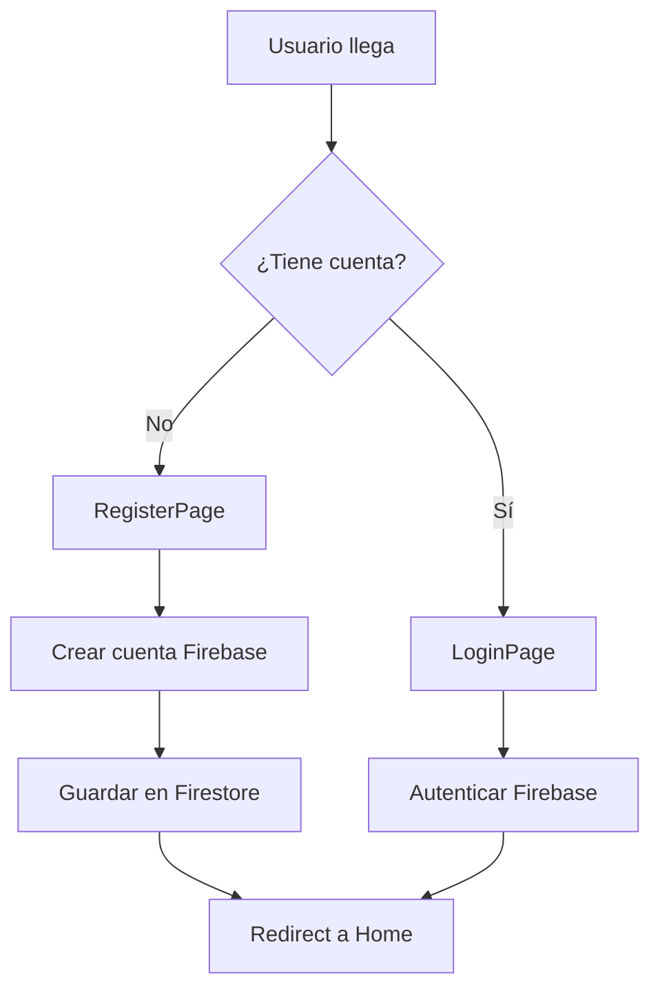
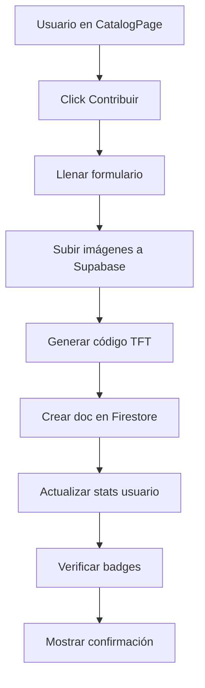

# 📚 BookMatch - Documentación Técnica

## Índice
1. [Visión General](#visión-general)
2. [Arquitectura](#arquitectura)
3. [Estructura del Proyecto](#estructura-del-proyecto)
4. [Tecnologías](#tecnologías)
5. [Instalación](#instalación)
6. [Configuración](#configuración)
7. [API Reference](#api-reference)
8. [Componentes](#componentes)
9. [Servicios](#servicios)
10. [Flujos de Usuario](#flujos-de-usuario)
11. [Seguridad](#seguridad)
12. [Testing](#testing)
13. [Deployment](#deployment)
14. [Contribuir](#contribuir)

---

## Visión General

BookMatch (también conocido como Ruedelo) es una plataforma de intercambio de libros basada en el sistema TFT (Take For Trade). Permite a los usuarios contribuir libros, generar códigos únicos TFT, y realizar intercambios de libros físicos mientras ganan insignias y avanzan en niveles de lectura.

### Características Principales
- 🔐 Autenticación segura con Firebase
- 📖 Sistema de contribución y tracking de libros
- 🏆 Sistema de badges/insignias por logros
- 🔄 Intercambios peer-to-peer con códigos TFT
- 👥 Perfiles de usuario con estadísticas
- 🎯 Recomendaciones de libros
- 📱 Diseño responsive (Mobile-first)
- 💳 Integración con wallet cripto (Web3)

---

## Arquitectura

### Arquitectura General
```
┌─────────────┐     ┌──────────────┐     ┌─────────────┐
│   Frontend  │────▶│   Firebase   │────▶│  Firestore  │
│  React + TS │     │  Auth + DB   │     │  Database   │
└─────────────┘     └──────────────┘     └─────────────┘
       │                                         │
       │                                         │
       ▼                                         ▼
┌─────────────┐                          ┌─────────────┐
│   Backend   │                          │  Supabase   │
│  Node.js +  │                          │   Storage   │
│   Express   │                          │   (Images)  │
└─────────────┘                          └─────────────┘
```

### Stack Tecnológico

#### Frontend
- **Framework**: React 18.2 + TypeScript 4.9
- **Routing**: React Router v6
- **UI**: Material-UI v5 + TailwindCSS
- **State Management**: Context API + React Hooks
- **Forms**: React Hook Form + Validación personalizada
- **Notifications**: Notistack
- **Animations**: Framer Motion

#### Backend
- **Runtime**: Node.js
- **Framework**: Express.js
- **Authentication**: Firebase Auth
- **Database**: Firestore (Firebase)
- **Storage**: Supabase Storage
- **JWT**: jsonwebtoken

---

## Estructura del Proyecto

```
bookmatch/
├── frontend/
│   ├── public/
│   │   ├── index.html
│   │   └── manifest.json
│   ├── src/
│   │   ├── components/          # Componentes reutilizables
│   │   │   ├── home/            # Componentes del home
│   │   │   ├── library/         # Componentes de biblioteca
│   │   │   ├── profile/         # Componentes de perfil
│   │   │   ├── BottomNav.tsx
│   │   │   ├── Footer.tsx
│   │   │   ├── Navbar.tsx
│   │   │   └── TopAppBar.tsx
│   │   ├── config/              # Configuraciones
│   │   │   ├── firebase.ts      # Config Firebase
│   │   │   └── supabase.ts      # Config Supabase
│   │   ├── context/             # Context Providers
│   │   │   ├── AuthContext.tsx  # Autenticación
│   │   │   └── MenuContext.tsx  # Estado del menú
│   │   ├── data/                # Datos mock
│   │   │   ├── mockBooks.ts
│   │   │   ├── mockEvents.ts
│   │   │   └── mockProfiles.ts
│   │   ├── pages/               # Páginas principales
│   │   │   ├── HomePage.tsx
│   │   │   ├── CatalogPage.tsx
│   │   │   ├── EventsPage.tsx
│   │   │   ├── LibraryPage.tsx
│   │   │   ├── ProfilePage.tsx
│   │   │   ├── LoginPage.tsx
│   │   │   └── RegisterPage.tsx
│   │   ├── services/            # Lógica de negocio
│   │   │   ├── authService.ts
│   │   │   ├── bookService.ts
│   │   │   ├── badgeService.ts
│   │   │   ├── matchService.ts
│   │   │   └── storageService.ts
│   │   ├── theme/               # Tema MUI
│   │   │   └── theme.ts
│   │   ├── types/               # TypeScript types
│   │   │   └── profile.ts
│   │   ├── utils/               # Utilidades
│   │   │   └── validation.ts
│   │   ├── App.tsx              # Componente raíz
│   │   └── index.tsx            # Entry point
│   ├── .env.example
│   ├── package.json
│   ├── tsconfig.json
│   └── tailwind.config.js
│
├── backend/
│   ├── config/
│   │   └── supabase.js          # Cliente Supabase
│   ├── server.js                # Servidor Express
│   ├── .env.example
│   └── package.json
│
├── docs/                        # Documentación
│   ├── README.md               # Este archivo
│   ├── API.md                  # Documentación de API
│   ├── ARCHITECTURE.md         # Arquitectura detallada
│   └── CONTRIBUTING.md         # Guía de contribución
│
└── README.md                    # Readme principal
```

---

## Tecnologías

### Frontend Dependencies

| Dependencia | Versión | Propósito |
|-------------|---------|-----------|
| react | 18.2.0 | Framework UI |
| react-router-dom | 6.21.1 | Routing |
| @mui/material | 5.15.6 | UI Components |
| tailwindcss | 3.4.18 | Utility CSS |
| firebase | 12.3.0 | Backend services |
| @supabase/supabase-js | 2.58.0 | Storage |
| axios | 1.6.5 | HTTP client |
| notistack | 3.0.1 | Notificaciones |
| framer-motion | 12.23.22 | Animaciones |

### Backend Dependencies

| Dependencia | Versión | Propósito |
|-------------|---------|-----------|
| express | 4.21.2 | Web framework |
| @supabase/supabase-js | 2.58.0 | DB/Storage |
| jsonwebtoken | 9.0.2 | JWT auth |
| bcryptjs | 3.0.2 | Hash passwords |
| cors | 2.8.5 | CORS middleware |
| dotenv | 16.6.1 | Env variables |

---

## Instalación

### Prerequisitos
- Node.js >= 16.x
- npm >= 8.x
- Git
- Cuenta en Firebase
- Cuenta en Supabase (opcional, solo storage)

### Pasos

1. **Clonar el repositorio**
```bash
git clone <repository-url>
cd bookmatch
```

2. **Instalar dependencias del frontend**
```bash
cd frontend
npm install
```

3. **Instalar dependencias del backend**
```bash
cd ../backend
npm install
```

4. **Configurar variables de entorno** (ver sección de Configuración)

5. **Iniciar modo desarrollo**

Frontend:
```bash
cd frontend
npm start
```

Backend:
```bash
cd backend
npm run dev
```

---

## Configuración

### Variables de Entorno - Frontend

Crear archivo `.env` en `frontend/`:

```env
# Firebase Configuration
REACT_APP_FIREBASE_API_KEY=your_api_key
REACT_APP_FIREBASE_AUTH_DOMAIN=your_project.firebaseapp.com
REACT_APP_FIREBASE_PROJECT_ID=your_project_id
REACT_APP_FIREBASE_STORAGE_BUCKET=your_project.appspot.com
REACT_APP_FIREBASE_MESSAGING_SENDER_ID=your_sender_id
REACT_APP_FIREBASE_APP_ID=your_app_id

# Supabase Configuration (Storage only)
REACT_APP_SUPABASE_URL=https://your-project.supabase.co
REACT_APP_SUPABASE_ANON_KEY=your_anon_key
```

### Variables de Entorno - Backend

Crear archivo `.env` en `backend/`:

```env
# Server
PORT=5000
NODE_ENV=development

# Supabase
SUPABASE_URL=https://your-project.supabase.co
SUPABASE_ANON_KEY=your_anon_key

# JWT
JWT_SECRET=your_super_secret_key_change_in_production

# Frontend URL (for CORS)
FRONTEND_URL=http://localhost:3000
```

### Configuración de Firebase

1. Crear proyecto en [Firebase Console](https://console.firebase.google.com)
2. Habilitar Authentication (Email/Password)
3. Crear base de datos Firestore
4. Configurar reglas de seguridad (ver `docs/SECURITY.md`)

### Configuración de Supabase (Storage)

1. Crear proyecto en [Supabase](https://supabase.com)
2. Crear bucket `book-images` público
3. Copiar URL y API Key

---

## API Reference

### Autenticación

#### POST `/api/register`
Registra un nuevo usuario.

**Request:**
```json
{
  "email": "user@example.com",
  "password": "password123"
}
```

**Response:**
```json
{
  "success": true,
  "message": "Usuario registrado exitosamente",
  "user": {
    "uid": "user_id",
    "email": "user@example.com"
  }
}
```

#### GET `/api/health`
Verifica estado del servidor y conexión a Supabase.

**Response:**
```json
{
  "status": "ok",
  "message": "Servidor y Supabase funcionando correctamente",
  "supabaseConnected": true
}
```

### Libros (Próximamente)
- POST `/api/books` - Contribuir libro
- GET `/api/books` - Listar libros
- GET `/api/books/:id` - Obtener libro
- POST `/api/books/:id/transfer` - Transferir libro

### Perfiles (Próximamente)
- GET `/api/users/:id` - Obtener perfil
- PUT `/api/users/:id` - Actualizar perfil
- GET `/api/users/:id/badges` - Obtener insignias

---

## Componentes

### Componentes Principales

#### `<AuthProvider>`
Context provider para autenticación.

**Props:** `{ children: ReactNode }`

**Métodos:**
- `login(email, password)` - Iniciar sesión
- `logout()` - Cerrar sesión
- `register(data)` - Registrar usuario
- `connectWallet()` - Conectar wallet cripto

#### `<TopAppBar>`
Barra de navegación superior con búsqueda.

#### `<BottomNav>`
Navegación inferior para móvil.

#### `<ProfileCard>`
Tarjeta de perfil de usuario.

**Props:**
```typescript
{
  id: string;
  name: string;
  avatar: string;
  level: number;
  booksLinked: number;
}
```

---

## Servicios

### authService.ts

Maneja autenticación con Firebase.

```typescript
// Registrar usuario
registerUser(data: RegisterData): Promise<User>

// Iniciar sesión
loginUser(email: string, password: string): Promise<User>

// Cerrar sesión
logoutUser(): Promise<void>

// Usuario actual
getCurrentUser(): User | null
```

### bookService.ts

Gestión de libros y sistema TFT.

```typescript
// Contribuir libro al sistema
contributeBook(userId: string, bookData: BookData): Promise<string>

// Vincular libro (deprecated)
linkBookToUser(userId: string, book: Book): Promise<void>

// Registrar intercambio
recordExchange(userId: string): Promise<void>

// Asistencia a evento
recordEventAttendance(userId: string): Promise<void>
```

### badgeService.ts

Sistema de insignias y logros.

```typescript
// Verificar y otorgar badges
checkAndAwardBadges(userId: string, stats: UserStats): Promise<Badge[]>

// Obtener badges del usuario
getUserBadges(userId: string): Promise<Badge[]>
```

### storageService.ts

Gestión de almacenamiento de imágenes.

```typescript
// Subir imagen
uploadImage(file: File, path: string): Promise<string>

// Eliminar imagen
deleteImage(path: string): Promise<void>
```

---

## Flujos de Usuario

### 1. Registro e Inicio de Sesión



### 2. Contribuir Libro



### 3. Sistema de Badges

Los badges se otorgan automáticamente cuando el usuario alcanza ciertos hitos:

- **Primera Contribución**: 1 libro vinculado
- **Coleccionista**: 5 libros vinculados
- **Bibliófilo**: 10 libros vinculados
- **Primer Intercambio**: 1 intercambio
- **Intercambiador**: 5 intercambios
- **Social**: 3 eventos asistidos

---

## Seguridad

### Autenticación
- Firebase Authentication con email/password
- JWT para sesiones
- Tokens de autenticación en headers

### Firestore Rules (Recomendadas)

```javascript
rules_version = '2';
service cloud.firestore {
  match /databases/{database}/documents {
    // Users
    match /users/{userId} {
      allow read: if request.auth != null;
      allow write: if request.auth.uid == userId;
    }

    // Books
    match /books/{bookId} {
      allow read: if request.auth != null;
      allow create: if request.auth != null;
      allow update: if request.auth.uid == resource.data.currentHolder;
    }

    // Badges
    match /badges/{badgeId} {
      allow read: if request.auth != null;
      allow write: if false; // Solo servidor
    }
  }
}
```

### Supabase Storage Policies

```sql
-- Book images bucket
CREATE POLICY "Public read access"
ON storage.objects FOR SELECT
USING (bucket_id = 'book-images');

CREATE POLICY "Authenticated upload"
ON storage.objects FOR INSERT
WITH CHECK (bucket_id = 'book-images' AND auth.role() = 'authenticated');
```

### Buenas Prácticas
- ✅ Nunca exponer API keys en el código
- ✅ Usar variables de entorno
- ✅ Validar inputs en frontend y backend
- ✅ Sanitizar datos antes de guardar
- ✅ Implementar rate limiting
- ✅ HTTPS en producción

---

## Testing

### Estructura de Tests

```
frontend/src/
├── __tests__/
│   ├── components/
│   ├── services/
│   └── utils/
```

### Comandos

```bash
# Run tests
npm test

# Coverage
npm test -- --coverage

# Watch mode
npm test -- --watch
```

### Ejemplo de Test

```typescript
// bookService.test.ts
import { contributeBook } from '../services/bookService';

describe('bookService', () => {
  it('should generate TFT code correctly', async () => {
    const code = await contributeBook('user123', {
      title: 'Test Book',
      author: 'Test Author',
      city: 'Bogotá'
    });

    expect(code).toMatch(/^TFT-[A-Z0-9]{3}[A-Z0-9]$/);
  });
});
```

---

## Deployment

### Frontend (Vercel/Netlify)

1. **Build**
```bash
cd frontend
npm run build
```

2. **Variables de entorno**
Configurar en el dashboard de Vercel/Netlify

3. **Deploy**
```bash
vercel --prod
# o
netlify deploy --prod
```

### Backend (Railway/Render)

1. **Preparar**
```bash
cd backend
npm install --production
```

2. **Variables de entorno**
Configurar en el dashboard

3. **Start command**
```bash
node server.js
```

### Checklist Pre-Deploy

- [ ] Variables de entorno configuradas
- [ ] CORS configurado para dominio de producción
- [ ] Firebase rules de seguridad aplicadas
- [ ] Supabase policies configuradas
- [ ] Tests pasando
- [ ] Build exitoso
- [ ] SSL/HTTPS configurado

---

## Contribuir

### Workflow

1. Fork el repositorio
2. Crear branch feature (`git checkout -b feature/AmazingFeature`)
3. Commit cambios (`git commit -m 'Add some AmazingFeature'`)
4. Push al branch (`git push origin feature/AmazingFeature`)
5. Abrir Pull Request

### Estándares de Código

#### TypeScript/JavaScript
- ESLint configurado
- Prettier para formato
- Naming: camelCase para variables, PascalCase para componentes

#### Commits
Seguir [Conventional Commits](https://www.conventionalcommits.org/):

```
feat: add new badge system
fix: resolve login issue
docs: update API documentation
refactor: improve bookService performance
test: add tests for authService
```

#### Code Review
- Mínimo 1 aprobación
- Tests deben pasar
- Sin conflictos con main
- Documentación actualizada

---

## Roadmap

### v1.0 (Actual - MVP)
- [x] Autenticación básica
- [x] Sistema de badges
- [x] Contribución de libros
- [ ] Intercambios funcionales
- [ ] Backend completo

### v1.1
- [ ] Chat entre usuarios
- [ ] Notificaciones push
- [ ] Búsqueda avanzada
- [ ] Filtros por ciudad

### v2.0
- [ ] NFTs para libros raros
- [ ] Marketplace de intercambios
- [ ] Sistema de reputación
- [ ] App móvil nativa

---

## Soporte

- **Email**: soporte@bookmatch.com
- **Issues**: [GitHub Issues](https://github.com/your-repo/issues)
- **Discord**: [Comunidad BookMatch](https://discord.gg/bookmatch)

---

## Licencia

MIT License - ver archivo [LICENSE](../LICENSE)

---

**Última actualización:** Octubre 2025
**Versión:** 1.0.0-beta
**Mantenedores:** @wendynieto
